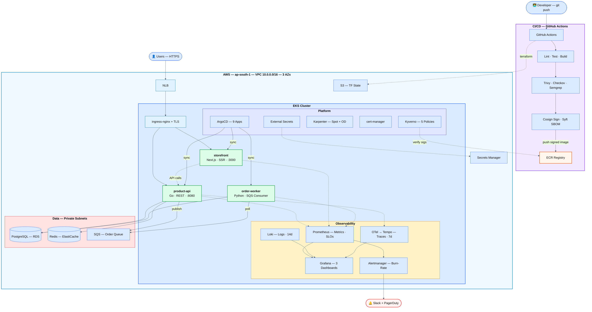

# CloudNative Commerce — Platform Infrastructure

Production infrastructure for a microservices e-commerce platform running on AWS.
Manages the full lifecycle from provisioning to observability to chaos resilience.

## Architecture



**Stack:**

| Layer | Tools |
|-------|-------|
| Application | Go, React/Next.js, Python, PostgreSQL, Redis |
| Container Orchestration | EKS, Karpenter, Kyverno |
| GitOps | ArgoCD, Kustomize |
| Infrastructure as Code | Terraform, Terragrunt |
| CI/CD + Supply Chain Security | GitHub Actions, Trivy, Cosign, SBOM |
| Observability | Prometheus, Grafana, Loki, OpenTelemetry |
| Chaos + Load Testing | Litmus Chaos, k6 |

## Services

| Service | Language | Description |
|---------|----------|-------------|
| `product-api` | Go | REST API — products, inventory, orders |
| `storefront` | React/Next.js | Customer-facing SPA |
| `order-worker` | Python | Async order processing via SQS |

## Infrastructure Overview

- **AWS region:** ap-south-1 (Mumbai), 3 AZs
- **Networking:** VPC with public/private subnet split — ALB in public, EKS nodes + RDS + Redis in private
- **EKS:** Managed node groups, IRSA for pod-level IAM, Karpenter for node autoscaling
- **Data:** RDS PostgreSQL (Multi-AZ), ElastiCache Redis, automated backups
- **Ingress:** ALB via ingress-nginx, TLS via cert-manager + ACM
- **Secrets:** External Secrets Operator pulling from AWS Secrets Manager
- **Image security:** All images scanned (Trivy), signed (Cosign), SBOM generated (Syft)

## Environments

| Environment | Purpose | Auto-deploy |
|-------------|---------|-------------|
| `dev` | Development, integration testing | Yes — on merge to `main` |
| `staging` | Pre-prod validation, load testing | Yes — after dev passes |
| `prod` | Production | Manual approval gate |

## Progress

| Layer | Status |
|-------|--------|
| Application (Go, React, Python) | :green_circle: Complete |
| Infrastructure as Code (Terraform, Terragrunt) | :green_circle: Complete |
| Kubernetes + GitOps (EKS, ArgoCD, Kustomize) | :green_circle: Complete |
| CI/CD + Supply Chain Security | :green_circle: Complete |
| Observability (Prometheus, Grafana, Loki, OTel) | :green_circle: Complete |
| Chaos + Reliability (Litmus, k6) | :yellow_circle: In progress |

## Observability Stack

**Metrics → Logs → Traces** — all accessible in a single Grafana instance.

| Component | Tool | Purpose |
|-----------|------|---------|
| Metrics | Prometheus + kube-prometheus-stack | Cluster + application metrics, 15d retention |
| Dashboards | Grafana | Golden signals, cluster health, cost/efficiency |
| Logging | Loki + Promtail | Label-indexed log aggregation, 14d retention |
| Tracing | OpenTelemetry Collector + Tempo | Distributed traces with tail-based sampling |
| Alerting | Alertmanager | Severity-based routing to PagerDuty + Slack |

### Grafana Dashboards

| Dashboard | What it shows |
|-----------|--------------|
| **Golden Signals** | Request rate, error rate, P50/P95/P99 latency, CPU/memory saturation per service |
| **Cluster Health** | Node readiness, pod count/restarts, CPU/memory/disk per node, deployment availability |
| **Cost & Efficiency** | Resource utilization efficiency, requested vs actual, over-provisioned container detection |

### SLO-Based Alerting (Google SRE Model)

Alerts fire based on **error budget burn rate**, not raw thresholds:

| Burn Rate | Time to Budget Exhaustion | Severity | Action |
|-----------|--------------------------|----------|--------|
| 14.4x | ~2 days | Critical | Page on-call immediately |
| 6x | ~5 days | Warning | Investigate within hours |
| 3x | ~10 days | Info | Investigate this week |

## Runbooks

- [Scale-up procedure](docs/runbooks/scale-up.md)
- [DB failover](docs/runbooks/db-failover.md)
- [Incident response](docs/runbooks/incident-response.md)

## Architecture Decision Records

| # | Decision |
|---|----------|
| [ADR-001](docs/adr/001-vpc-architecture.md) | VPC layout — 3-AZ public/private split |
| [ADR-002](docs/adr/002-why-eks-over-ecs.md) | EKS over ECS |
| [ADR-003](docs/adr/003-why-karpenter-over-cluster-autoscaler.md) | Karpenter over Cluster Autoscaler |
| [ADR-004](docs/adr/004-why-argocd-over-flux.md) | ArgoCD over Flux |
| [ADR-005](docs/adr/005-why-kyverno-over-opa-gatekeeper.md) | Kyverno over OPA/Gatekeeper |
| [ADR-006](docs/adr/006-why-loki-over-elk.md) | Loki over ELK |

## SLOs

| Service | Availability | Latency (p99) |
|---------|-------------|----------------|
| product-api | 99.9% | < 200ms |
| storefront | 99.5% | < 1s |
| order-worker | 99.9% (processing) | < 30s end-to-end |

## Chaos Engineering

| Experiment | Steady State | Last Run | Report |
|-----------|--------------|----------|--------|
| Pod kill — product-api | HPA recovers < 30s | — | — |
| Node drain | Karpenter replaces < 2min | — | — |
| Network partition | Orders queue, no data loss | — | — |

## Local Development

```bash
# Prerequisites: Docker, docker-compose
git clone https://github.com/akshayghalme/cloudnative-commerce.git
cd cloudnative-commerce
cp .env.example .env
make compose-up
```

## Deploying to AWS

```bash
# Prerequisites: AWS CLI (configured), Terraform >= 1.7, kubectl, Helm, gh CLI

# 1. Provision infrastructure
cd terraform/environments/dev
terraform init && terraform apply

# 2. Deploy platform components (cert-manager, ingress, external-secrets)
kubectl apply -f kubernetes/platform/

# 3. Bootstrap ArgoCD — it takes over from here
kubectl apply -f kubernetes/argocd/apps/
```

## Repository Layout

```
cloudnative-commerce/
├── services/           # Application source (Go, React, Python)
├── terraform/          # Modules + environment configs
├── kubernetes/         # Base manifests, Kustomize overlays, ArgoCD apps
├── .github/workflows/  # CI/CD pipelines
├── observability/      # Prometheus rules, Grafana dashboards, Loki, OTel
├── chaos/              # Litmus experiments, k6 load tests, game day reports
└── docs/               # ADRs, runbooks, failure reports, cost analysis
```
